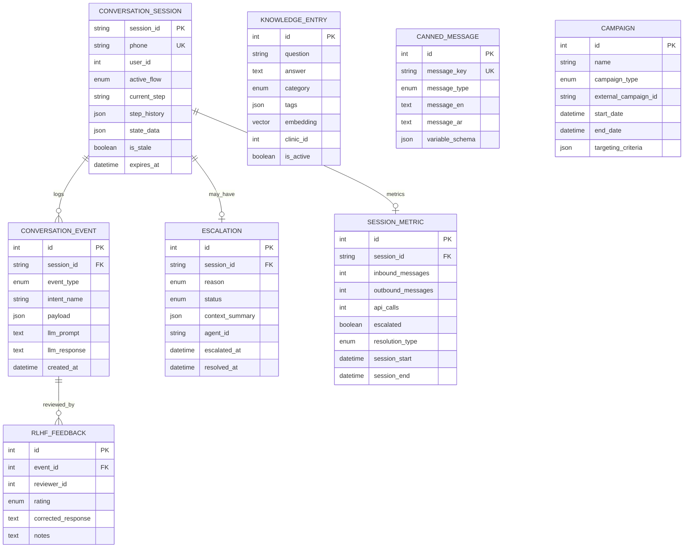

# PetsFirst WhatsApp AI Agent - Backend Architecture Plan

## Updated Architecture (Django as Orchestrator)

### New Flow

```
WhatsApp Business API
        │
        ▼
┌─────────────────────────────────────────┐
│  Django Backend (Orchestrator)          │
│  • Webhook receiver                     │
│  • Session management                   │
│  • Calls AI Service for LLM tasks       │
│  • Proxies to MCP for business data     │
│  • Sends response to WhatsApp          │
└──────────────┬──────────────────────────┘
               │
    ┌──────────┴──────────┐
    │                     │
    ▼                     ▼
┌─────────────┐    ┌─────────────────┐
│ AI Service  │    │ MCP Backend     │
│ (LLM only)  │    │ (Existing)      │
│             │    │                 │
│ • Intent    │    │ • Users         │
│ • Entities  │    │ • Pets          │
│ • Responses │    │ • Appointments  │
└─────────────┘    └─────────────────┘
```

### Why This Architecture

| Aspect | Previous (AI First) | New (Django First) |
|--------|---------------------|-------------------|
| **Entry Point** | AI Service (FastAPI) | Django (DRF) |
| **Session State** | Redis (AI) + Django (PG) | Django only (Redis + PG) |
| **AI Role** | Orchestrator | LLM microservice |
| **Authentication** | Two layers | Single layer (Django) |
| **Rate Limiting** | Distributed | Centralized (Django) |
| **Debugging** | Harder (distributed) | Easier (single entry) |

---

## 1. Django as Orchestrator

### 1.1 Responsibilities

| Responsibility | Django | AI Service |
|----------------|--------|------------|
| **WhatsApp Webhook** | ✅ Receives | ❌ |
| **Session Management** | ✅ Redis + PostgreSQL | ❌ |
| **Intent Classification** | Calls AI Service | ✅ LLM processing |
| **Entity Extraction** | Calls AI Service | ✅ LLM processing |
| **Response Generation** | Calls AI Service | ✅ LLM processing |
| **Business Data (MCP)** | ✅ Proxies to MCP | ❌ |
| **Knowledge Base (RAG)** | ✅ pgvector search | ❌ |
| **Canned Messages** | ✅ CMS | ❌ |
| **WhatsApp API Send** | ✅ Sends messages | ❌ |
| **Analytics/RLHF** | ✅ Logs events | ❌ |

### 1.2 Django Project Structure

```
django_backend/
├── config/
│   ├── settings/
│   │   ├── base.py
│   │   ├── local.py
│   │   └── production.py
│   ├── urls.py
│   └── wsgi.py
│
├── apps/
│   ├── webhooks/              # WhatsApp webhook receiver
│   │   ├── views.py           # Webhook handlers
│   │   ├── verification.py    # Signature verification
│   │   └── urls.py
│   │
│   ├── orchestrator/          # Main flow orchestration
│   │   ├── services/
│   │   │   ├── flow_engine.py      # Booking/Cancel/Reschedule flows
│   │   │   ├── state_manager.py    # Session state management
│   │   │   └── message_processor.py # Main entry point
│   │   ├── handlers/
│   │   │   ├── booking_handler.py
│   │   │   ├── cancel_handler.py
│   │   │   ├── faq_handler.py
│   │   │   └── handoff_handler.py
│   │   └── models.py          # (no models - uses conversations app)
│   │
│   ├── conversations/         # Session and event storage
│   │   ├── models.py          # Session, Event, Escalation
│   │   ├── views.py           # API endpoints
│   │   └── admin.py
│   │
│   ├── knowledge/             # RAG + Canned messages
│   │   ├── models.py          # KnowledgeEntry, CannedMessage, Campaign
│   │   ├── services/
│   │   │   └── rag_service.py # pgvector search
│   │   └── admin.py
│   │
│   ├── analytics/               # RLHF + Metrics
│   │   ├── models.py          # RLHFFeedback, SessionMetric
│   │   └── admin.py
│   │
│   └── proxy/                   # MCP API proxy
│       ├── clients/
│       │   └── mcp_client.py    # HTTP client for MCP
│       └── views.py             # Proxy endpoints
│
├── clients/
│   ├── ai_service_client.py   # HTTP client for AI microservice
│   └── whatsapp_client.py      # WABA API client
│
├── services/
│   ├── redis_service.py        # Redis connection
│   └── embedding_service.py    # OpenAI embeddings (optional)
│
└── tests/
```

---

## 2. Database Schema (Same - Django Stores)

### 2.1 ERD (Unchanged)



---

## 3. Django Models (Same)

```python
# apps/conversations/models.py
from django.db import models


class ConversationSession(models.Model):
    """Tracks conversation flow state per WhatsApp phone number."""
    
    class Flow(models.TextChoices):
        IDLE = "idle", "Idle"
        BOOKING = "booking", "Booking"
        CANCEL = "cancel", "Cancel"
        RESCHEDULE = "reschedule", "Reschedule"
        FAQ = "faq", "FAQ"
        HANDOFF = "handoff", "Handoff"
    
    session_id = models.CharField(max_length=64, primary_key=True)
    phone = models.CharField(max_length=20, db_index=True)
    user_id = models.IntegerField(null=True, blank=True)  # From MCP identify
    
    active_flow = models.CharField(max_length=20, choices=Flow.choices, default=Flow.IDLE)
    current_step = models.CharField(max_length=50, blank=True)
    step_history = models.JSONField(default=list)
    state_data = models.JSONField(default=dict)
    
    is_stale = models.BooleanField(default=False)
    expires_at = models.DateTimeField()
    last_activity_at = models.DateTimeField(auto_now=True)
    created_at = models.DateTimeField(auto_now_add=True)
    
    class Meta:
        db_table = "conversation_sessions"
        indexes = [
            models.Index(fields=["phone", "expires_at"]),
            models.Index(fields=["active_flow", "current_step"]),
        ]


class ConversationEvent(models.Model):
    """Immutable audit log for debugging and RLHF."""
    
    class EventType(models.TextChoices):
        INTENT_CLASSIFIED = "intent_classified", "Intent Classified"
        ENTITIES_EXTRACTED = "entities_extracted", "Entities Extracted"
        API_CALLED = "api_called", "API Called"
        STATE_CHANGED = "state_changed", "State Changed"
        HANDOFF_TRIGGERED = "handoff_triggered", "Handoff Triggered"
        ERROR = "error", "Error"
    
    session = models.ForeignKey(ConversationSession, on_delete=models.CASCADE, related_name="events")
    event_type = models.CharField(max_length=30, choices=EventType.choices)
    intent_name = models.CharField(max_length=50, blank=True)
    payload = models.JSONField(default=dict)
    llm_prompt = models.TextField(blank=True)
    llm_response = models.TextField(blank=True)
    created_at = models.DateTimeField(auto_now_add=True)
    
    class Meta:
        db_table = "conversation_events"
        ordering = ["-created_at"]


class Escalation(models.Model):
    """Human handoff tracking."""
    
    class Reason(models.TextChoices):
        USER_REQUEST = "user_request", "User Requested"
        FAILED_INTENT = "failed_intent", "Failed Intent"
        API_FAILURE = "api_failure", "API Failure"
        MEDICAL_QUERY = "medical_query", "Medical Query"
        COMPLAINT = "complaint", "Complaint"
    
    class Status(models.TextChoices):
        PENDING = "pending", "Pending"
        ASSIGNED = "assigned", "Assigned"
        RESOLVED = "resolved", "Resolved"
        RETURNED = "returned", "Returned to Bot"
    
    session = models.OneToOneField(ConversationSession, on_delete=models.CASCADE)
    reason = models.CharField(max_length=20, choices=Reason.choices)
    status = models.CharField(max_length=20, choices=Status.choices, default=Status.PENDING)
    context_summary = models.JSONField(default=dict)
    agent_id = models.CharField(max_length=50, blank=True)
    escalated_at = models.DateTimeField(auto_now_add=True)
    resolved_at = models.DateTimeField(null=True, blank=True)
    
    class Meta:
        db_table = "escalations"
```

---

## 4. New Flow: Django Orchestrates

### 4.1 Webhook Handler (Django Receives)

```python
# apps/webhooks/views.py
from rest_framework.decorators import api_view
from rest_framework.response import Response
from django.core.cache import cache
import hmac
import hashlib
import json

from apps.orchestrator.services.message_processor import MessageProcessor


@api_view(['GET'])
def whatsapp_verify(request):
    """
    GET /webhooks/whatsapp
    Meta verification challenge for webhook setup.
    """
    mode = request.query_params.get('hub.mode')
    token = request.query_params.get('hub.verify_token')
    challenge = request.query_params.get('hub.challenge')
    
    if mode == 'subscribe' and token == settings.WHATSAPP_VERIFY_TOKEN:
        return Response(challenge, content_type='text/plain')
    return Response(status=403)


@api_view(['POST'])
def whatsapp_webhook(request):
    """
    POST /webhooks/whatsapp
    Main entry point: Django receives WhatsApp message.
    """
    # Verify signature
    signature = request.headers.get('X-Hub-Signature-256')
    if not verify_signature(request.body, signature):
        return Response(status=401)
    
    # Parse payload
    payload = json.loads(request.body)
    
    # Process each entry (background task)
    for entry in payload.get('entry', []):
        for change in entry.get('changes', []):
            value = change.get('value', {})
            messages = value.get('messages', [])
            
            for message in messages:
                # Extract data
                phone = message.get('from')
                message_id = message.get('id')
                message_type = message.get('type')
                content = extract_content(message, message_type)
                
                # PROCESS HERE (sync for now, can use Celery later)
                processor = MessageProcessor()
                processor.process(phone, message_id, message_type, content)
    
    return Response({"status": "ok"})


def verify_signature(body, signature):
    """Verify WhatsApp webhook signature."""
    if not signature:
        return False
    expected = hmac.new(
        settings.WHATSAPP_APP_SECRET.encode(),
        body,
        hashlib.sha256
    ).hexdigest()
    return hmac.compare_digest(f"sha256={expected}", signature)


def extract_content(message, msg_type):
    """Extract content based on WhatsApp message type."""
    if msg_type == 'text':
        return {'type': 'text', 'text': message.get('text', {}).get('body', '')}
    elif msg_type == 'interactive':
        interactive = message.get('interactive', {})
        if interactive.get('type') == 'button_reply':
            return {
                'type': 'button_reply',
                'id': interactive.get('button_reply', {}).get('id'),
                'title': interactive.get('button_reply', {}).get('title')
            }
    # ... other types
    return {'type': 'unknown', 'raw': message}
```

### 4.2 Message Processor (Django Orchestrates)

```python
# apps/orchestrator/services/message_processor.py
from django.core.cache import cache
from django.utils import timezone
from datetime import timedelta

from apps.conversations.models import ConversationSession, ConversationEvent
from apps.proxy.clients.mcp_client import MCPClient
from apps.clients.ai_service_client import AIServiceClient
from apps.clients.whatsapp_client import WhatsAppClient
from apps.knowledge.services.rag_service import RAGService


class MessageProcessor:
    """
    Main orchestrator: Django controls the flow.
    
    1. Manages session state
    2. Calls AI Service for LLM tasks
    3. Proxies to MCP for business data
    4. Sends responses to WhatsApp
    """
    
    def __init__(self):
        self.mcp = MCPClient()
        self.ai = AIServiceClient()
        self.whatsapp = WhatsAppClient()
        self.rag = RAGService()
    
    def process(self, phone: str, message_id: str, message_type: str, content: dict):
        """Main processing pipeline."""
        
        # 1. Mark message as read
        self.whatsapp.mark_as_read(message_id)
        
        # 2. Get or create session
        session = self._get_or_create_session(phone)
        
        # 3. Extract text from content
        text = self._extract_text(content)
        
        # 4. Identify user via MCP proxy
        user = self.mcp.identify_user(phone)
        if not user:
            return self._handle_unregistered(phone)
        
        # Store user_id in session
        session.user_id = user['id']
        session.save()
        
        # 5. Classify intent via AI Service
        intent_result = self.ai.classify_intent(
            message=text,
            context={
                'active_flow': session.active_flow,
                'user_pets': self.mcp.fetch_pets(phone)  # Get pets for context
            }
        )
        
        # Log event
        ConversationEvent.objects.create(
            session=session,
            event_type=ConversationEvent.EventType.INTENT_CLASSIFIED,
            intent_name=intent_result['primary_intent'],
            payload=intent_result,
            llm_prompt=f"Classify: {text}",
            llm_response=json.dumps(intent_result)
        )
        
        # 6. Route to handler
        handlers = {
            'booking': self._handle_booking,
            'cancel': self._handle_cancel,
            'reschedule': self._handle_reschedule,
            'faq': self._handle_faq,
            'handoff': self._handle_handoff
        }
        
        handler = handlers.get(intent_result['primary_intent'], self._handle_fallback)
        handler(session, user, text, intent_result)
    
    def _handle_booking(self, session, user, text, intent):
        """Handle booking flow."""
        from apps.orchestrator.handlers.booking_handler import BookingHandler
        
        handler = BookingHandler(self.mcp, self.ai, self.whatsapp, self.rag)
        handler.handle(session, user, text, intent)
    
    def _handle_faq(self, session, user, text, intent):
        """Handle FAQ with RAG."""
        # Search knowledge base (Django pgvector)
        results = self.rag.search(
            query=text,
            category='faq',
            clinic_id=session.state_data.get('selected_clinic_id')
        )
        
        # Generate answer via AI Service
        answer = self.ai.answer_faq(question=text, retrieved_context=results)
        
        # Check if mid-flow
        if session.active_flow not in [ConversationSession.Flow.IDLE, ConversationSession.Flow.FAQ]:
            # Add resume prompt
            answer += f"\n\nShall we continue with your {session.active_flow}?"
        
        # Send response
        self.whatsapp.send_message(session.phone, answer)
    
    def _get_or_create_session(self, phone: str) -> ConversationSession:
        """Get active session or create new one."""
        # Try cache first (Redis)
        cache_key = f"session:{phone}"
        session_id = cache.get(cache_key)
        
        if session_id:
            try:
                session = ConversationSession.objects.get(
                    session_id=session_id,
                    expires_at__gt=timezone.now()
                )
                # Extend TTL
                session.expires_at = timezone.now() + timedelta(minutes=30)
                session.save()
                cache.set(cache_key, session_id, timeout=1800)
                return session
            except ConversationSession.DoesNotExist:
                pass
        
        # Create new session
        session = ConversationSession.objects.create(
            session_id=f"{phone}_{int(timezone.now().timestamp())}",
            phone=phone,
            expires_at=timezone.now() + timedelta(minutes=30)
        )
        
        cache.set(cache_key, session.session_id, timeout=1800)
        return session
```

### 4.3 AI Service Client (Django Calls AI)

```python
# apps/clients/ai_service_client.py
import httpx
import json


class AIServiceClient:
    """
    Client for AI microservice.
    AI Service is stateless - just processes LLM requests.
    """
    
    def __init__(self, base_url: str = "http://localhost:8001"):
        self.base_url = base_url.rstrip("/")
        self.client = httpx.Client(timeout=30.0)
    
    def classify_intent(self, message: str, context: dict) -> dict:
        """Call AI Service to classify intent."""
        response = self.client.post(
            f"{self.base_url}/api/nlu/classify",
            json={
                "message": message,
                "context": context,
                "model": "gpt-4o-mini"
            }
        )
        return response.json()
    
    def extract_entities(self, message: str, user_context: dict) -> dict:
        """Call AI Service to extract entities."""
        response = self.client.post(
            f"{self.base_url}/api/nlu/extract",
            json={
                "message": message,
                "user_context": user_context
            }
        )
        return response.json()
    
    def map_service(self, user_input: str, available_services: list) -> dict:
        """Call AI Service to map service."""
        response = self.client.post(
            f"{self.base_url}/api/nlu/map-service",
            json={
                "user_input": user_input,
                "available_services": available_services
            }
        )
        return response.json()
    
    def generate_response(self, context: dict, response_type: str = "general") -> str:
        """Call AI Service to generate WhatsApp response."""
        response = self.client.post(
            f"{self.base_url}/api/generate/response",
            json={
                "context": context,
                "response_type": response_type
            }
        )
        return response.json()["text"]
    
    def answer_faq(self, question: str, retrieved_context: list) -> str:
        """Call AI Service to answer FAQ."""
        response = self.client.post(
            f"{self.base_url}/api/generate/faq",
            json={
                "question": question,
                "retrieved_context": retrieved_context
            }
        )
        return response.json()["answer"]
```

### 4.4 MCP Client (Django Proxies)

```python
# apps/proxy/clients/mcp_client.py
import httpx


class MCPClient:
    """
    Client for MCP Backend (external system).
    Django proxies these calls - no storage.
    """
    
    def __init__(self):
        self.base_url = "https://stage-petsfirst-backend.azurewebsites.net"
        self.prefix = "/api/mcp"
        self.client = httpx.Client(timeout=30.0)
    
    def identify_user(self, phone: str) -> dict:
        """GET /api/mcp/users/identifyByPhone/{phone}"""
        response = self.client.get(
            f"{self.base_url}{self.prefix}/users/identifyByPhone/{phone}"
        )
        result = response.json()
        return result.get("data")  # None if unregistered
    
    def fetch_pets(self, phone: str) -> list:
        """GET /api/mcp/pets/fetchPetsByPhone/{phone}"""
        response = self.client.get(
            f"{self.base_url}{self.prefix}/pets/fetchPetsByPhone/{phone}"
        )
        return response.json().get("data", [])
    
    def fetch_clinics(self) -> list:
        """GET /api/mcp/clinics"""
        response = self.client.get(f"{self.base_url}{self.prefix}/clinics")
        return response.json().get("data", [])
    
    def fetch_services(self, clinic_id: int, pet_id: int = None) -> list:
        """GET /api/mcp/services/{clinic_id}?petId={}"""
        params = {"petId": pet_id} if pet_id else None
        response = self.client.get(
            f"{self.base_url}{self.prefix}/services/{clinic_id}",
            params=params
        )
        return response.json().get("services", [])
    
    def fetch_slots(self, clinic_id: int, date: str) -> list:
        """GET /api/mcp/slots?clinicId={}&startDate={}"""
        response = self.client.get(
            f"{self.base_url}{self.prefix}/slots",
            params={"clinicId": clinic_id, "startDate": date}
        )
        return response.json().get("data", [])
    
    def fetch_appointments(self, phone: str) -> list:
        """GET /api/mcp/appointments/fetchAppointmentsByPhone/{phone}"""
        response = self.client.get(
            f"{self.base_url}{self.prefix}/appointments/fetchAppointmentsByPhone/{phone}"
        )
        return response.json().get("data", [])
    
    def create_appointment(self, data: dict) -> dict:
        """POST /api/mcp/appointments"""
        response = self.client.post(
            f"{self.base_url}{self.prefix}/appointments",
            json=data
        )
        return response.json()
    
    def cancel_appointment(self, appointment_id: int, phone: str) -> dict:
        """DELETE /api/mcp/appointments/{id}?phone={}"""
        response = self.client.delete(
            f"{self.base_url}{self.prefix}/appointments/{appointment_id}?phone={phone}"
        )
        return response.json()
    
    def reschedule_appointment(self, appointment_id: int, new_start: str, phone: str) -> dict:
        """PATCH /api/mcp/appointments/{id}"""
        response = self.client.patch(
            f"{self.base_url}{self.prefix}/appointments/{appointment_id}",
            json={"data": {"startTime": new_start}, "phone": phone}
        )
        return response.json()
```

### 4.5 WhatsApp Client (Django Sends)

```python
# apps/clients/whatsapp_client.py
import httpx


class WhatsAppClient:
    """
    Client for WhatsApp Business API.
    Django sends messages directly.
    """
    
    def __init__(self):
        self.api_url = "https://graph.facebook.com/v18.0"
        self.phone_number_id = settings.WHATSAPP_PHONE_NUMBER_ID
        self.access_token = settings.WHATSAPP_ACCESS_TOKEN
        self.client = httpx.Client(timeout=30.0)
    
    def send_message(self, to: str, text: str):
        """Send text message."""
        response = self.client.post(
            f"{self.api_url}/{self.phone_number_id}/messages",
            headers={"Authorization": f"Bearer {self.access_token}"},
            json={
                "messaging_product": "whatsapp",
                "recipient_type": "individual",
                "to": to,
                "type": "text",
                "text": {"body": text}
            }
        )
        return response.json()
    
    def send_interactive_list(self, to: str, header: str, body: str, button: str, sections: list):
        """Send interactive list message."""
        response = self.client.post(
            f"{self.api_url}/{self.phone_number_id}/messages",
            headers={"Authorization": f"Bearer {self.access_token}"},
            json={
                "messaging_product": "whatsapp",
                "recipient_type": "individual",
                "to": to,
                "type": "interactive",
                "interactive": {
                    "type": "list",
                    "header": {"type": "text", "text": header},
                    "body": {"text": body},
                    "action": {
                        "button": button,
                        "sections": sections
                    }
                }
            }
        )
        return response.json()
    
    def send_buttons(self, to: str, body: str, buttons: list):
        """Send reply buttons."""
        response = self.client.post(
            f"{self.api_url}/{self.phone_number_id}/messages",
            headers={"Authorization": f"Bearer {self.access_token}"},
            json={
                "messaging_product": "whatsapp",
                "recipient_type": "individual",
                "to": to,
                "type": "interactive",
                "interactive": {
                    "type": "button",
                    "body": {"text": body},
                    "action": {
                        "buttons": [
                            {"type": "reply", "reply": {"id": b["id"], "title": b["title"]}}
                            for b in buttons
                        ]
                    }
                }
            }
        )
        return response.json()
    
    def mark_as_read(self, message_id: str):
        """Mark message as read."""
        response = self.client.post(
            f"{self.api_url}/{self.phone_number_id}/messages",
            headers={"Authorization": f"Bearer {self.access_token}"},
            json={
                "messaging_product": "whatsapp",
                "status": "read",
                "message_id": message_id
            }
        )
        return response.json()
```

---

## 5. Simplified AI Service

### 5.1 AI Service Structure (Stateless)

```python
# ai_service/main.py (FastAPI)
from fastapi import FastAPI
from pydantic import BaseModel
from typing import List, Dict
import openai

app = FastAPI()

# OpenAI client
client = openai.AsyncOpenAI(api_key=settings.OPENAI_API_KEY)


# Models
class ClassifyRequest(BaseModel):
    message: str
    context: dict
    model: str = "gpt-4o-mini"


class ExtractRequest(BaseModel):
    message: str
    user_context: dict


class GenerateRequest(BaseModel):
    context: dict
    response_type: str


# Endpoints
@app.post("/api/nlu/classify")
async def classify_intent(request: ClassifyRequest):
    """Classify user intent."""
    prompt = f"""Classify this message:
Message: "{request.message}"
Context: {request.context}

Return JSON: {{"primary_intent": "...", "confidence": 0.0}}"""
    
    response = await client.chat.completions.create(
        model=request.model,
        messages=[{"role": "user", "content": prompt}],
        response_format={"type": "json_object"}
    )
    
    return json.loads(response.choices[0].message.content)


@app.post("/api/nlu/extract")
async def extract_entities(request: ExtractRequest):
    """Extract entities."""
    prompt = f"""Extract entities from: "{request.message}"
User context: {request.user_context}

Return JSON with pet_names, service_hints, date_references, etc."""
    
    response = await client.chat.completions.create(
        model="gpt-4o-mini",
        messages=[{"role": "user", "content": prompt}],
        response_format={"type": "json_object"}
    )
    
    return json.loads(response.choices[0].message.content)


@app.post("/api/generate/response")
async def generate_response(request: GenerateRequest):
    """Generate WhatsApp response."""
    prompt = f"""Generate WhatsApp response:
Context: {request.context}
Type: {request.response_type}

Guidelines: conversational, warm, concise, no robotic phrases."""
    
    response = await client.chat.completions.create(
        model="gpt-4o-mini",
        messages=[{"role": "user", "content": prompt}],
        temperature=0.7
    )
    
    return {"text": response.choices[0].message.content}


@app.post("/api/generate/faq")
async def answer_faq(request: FAQRequest):
    """Answer FAQ from context."""
    context_text = "\n\n".join([
        f"Q: {c['question']}\nA: {c['answer']}"
        for c in request.retrieved_context
    ])
    
    prompt = f"""Answer using ONLY this knowledge:
{context_text}

Question: "{request.question}"

If not in context, say "I don't have that information.""""
    
    response = await client.chat.completions.create(
        model="gpt-4o-mini",
        messages=[{"role": "user", "content": prompt}],
        temperature=0.3
    )
    
    return {"answer": response.choices[0].message.content}


@app.post("/api/embeddings")
async def generate_embeddings(request: EmbeddingRequest):
    """Generate embeddings for RAG."""
    response = await client.embeddings.create(
        model="text-embedding-3-small",
        input=request.texts,
        dimensions=1536
    )
    
    return {"embeddings": [d.embedding for d in response.data]}
```

---

## 6. URL Routing (Django)

```python
# config/urls.py
from django.urls import path, include

urlpatterns = [
    # Admin
    path('admin/', admin.site.urls),
    
    # WhatsApp Webhook (Entry point)
    path('webhooks/', include('apps.webhooks.urls')),
    
    # API (for admin, debugging)
    path('api/', include('apps.conversations.urls')),
    path('api/', include('apps.knowledge.urls')),
    path('api/', include('apps.analytics.urls')),
    
    # Health check
    path('health', lambda r: JsonResponse({"status": "ok"})),
]
```

---

## 7. Summary: What Each Layer Does

| Component | Role | Technology |
|-----------|------|------------|
| **WhatsApp** | Messaging channel | WABA |
| **Django Backend** | **Orchestrator** - receives webhooks, manages state, calls AI, proxies to MCP, sends responses | Django DRF + Redis + PostgreSQL |
| **AI Service** | **LLM Processor** - stateless, only does intent/entity/response generation | FastAPI + OpenAI |
| **MCP Backend** | **Business Data** - users, pets, appointments (external) | External API |

### Request Flow

```
1. WhatsApp POST /webhooks/whatsapp
   ↓
2. Django receives → verifies signature
   ↓
3. Django: get/create session (Redis + PG)
   ↓
4. Django: identify user (call MCP)
   ↓
5. Django: classify intent (call AI Service)
   ↓
6. Django: log event (save to PG)
   ↓
7. Django: route to handler
   ↓
8. Handler: fetch data (call MCP)
   ↓
9. Handler: generate response (call AI Service)
   ↓
10. Django: send to WhatsApp
```

### Benefits of New Architecture

1. **Single Entry Point**: Django handles all incoming traffic
2. **Centralized State**: Session management only in Django
3. **Simpler AI Service**: Just LLM processing, no business logic
4. **Easier Debugging**: One place to trace requests
5. **Better Security**: Auth/rate limiting in one layer
6. **Simpler Testing**: Can mock AI Service easily

---

## 8. Environment Variables

```bash
# Django
DJANGO_SECRET_KEY=...
DJANGO_DEBUG=false
DATABASE_URL=postgres://...
REDIS_URL=redis://...

# MCP Backend
MCP_BACKEND_URL=https://stage-petsfirst-backend.azurewebsites.net

# AI Service
AI_SERVICE_URL=http://localhost:8001

# OpenAI (can be in Django or AI Service)
OPENAI_API_KEY=sk-...

# WhatsApp
WHATSAPP_API_URL=https://graph.facebook.com/v18.0
WHATSAPP_ACCESS_TOKEN=...
WHATSAPP_PHONE_NUMBER_ID=...
WHATSAPP_APP_SECRET=...
WHATSAPP_VERIFY_TOKEN=...
```

---

## 9. Updated AI Service Plan

The AI Service is now a **simple, stateless LLM microservice**:

```
AI Service (FastAPI)
├── /api/nlu/
│   ├── POST /classify      → Intent classification
│   ├── POST /extract       → Entity extraction
│   └── POST /map-service   → Service mapping
│
├── /api/generate/
│   ├── POST /response      → Response generation
│   └── POST /faq           → FAQ answering
│
└── /api/embeddings
    └── POST /              → Generate embeddings
```

**No session management, no business logic, no database.**

Just receives requests from Django, calls OpenAI, returns results.
